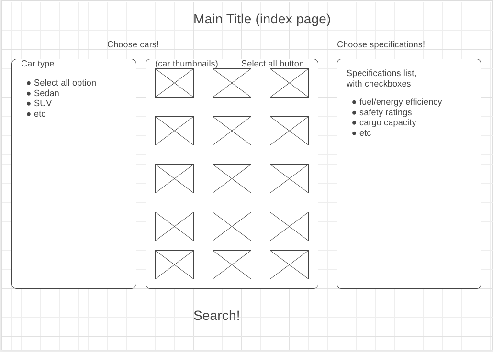

# JavaScript-project

### Background

At this site, users looking for information about new cars can select cars and get comparisons of their chosen cars based on the car specification categories of interest. Car searches can be customized, based on categories such as price, type(sedan, SUV, etc), and passenger capacity. The search will return cars and their data, which includes the user-selected categories, but also with additional data, such as fuel/energy efficiency ratings, safety ratings, and cargo capacity. Search results can be sorted by the different data categories, and the sorted data will be displayed visually in a bar graph.

### Functionality & MVPs

In this site, users will be able to:

- Select cars to search from a set of thumbnail images, with a button to select all
- Select specification categories to search from a list, with a button to select all
- See a resulting bar graph showing specification data
- Custom sort search results in the bar graph based on the specification categories

In addition, this project will include:

- Brief instructions at the start page
- Specification category legend
- A production README

### Wireframes

- The two left panels can be used to select cars to search. Car types will have checkboxes and thumbnails will be highlighted and display a check mark when selected.
- The third panel on the right is for selecting car specification categories. Each category will have a checkbox.
- The main search button is at the bottom.

- The main panel on the left will display the bar graph.
- The smaller right panel will display specifications, which the user can rearrange to re-sort the results.

### Technologies, Libraries, APIs

This project will be implemented with the following technologies:

- The NHTSA Product Information Catalog Vehicle Listing (vPIC) API (tentative).
    - Benefits of using this API would be the availability of the full database for user searches and potentially always having up to date data.
    - Drawbacks of attempting to use this API would be the potential unavailability of the necessary data, which would require reverting to manual fetching and seeding of data, as well as potentially needing to manually fetch some data if the API does not provide all required data.
- The D3 library to visually display data(tentative, vs other graph display library)
- Webpack and Babel to bundle and transpile the source JavaScript code
- npm to manage project dependencies

### Implementation Timeline

- Friday:
    - Setup project, including getting webpack up and running.
    - Create HTML skeleton for initial HTTP response
    - Create 5 classes for main panels on index (3 panels) and results (2 panels)
    - Test NHTSA API; if not feasible, manually gather data(spreadsheet and vehicle images), potentially narrowing scope of project to EVs only
    - Get "Car type" panel to display with data

- Weekend
    - Get car thumbnails to display
        - Implement check-boxes
        - Implement "Select All" feature
    - Get "Choose Specifications" panel to display
        - Create list of specs with check-boxes
        - Include "Select All" feature
    - Implement Results bar graph
        - Create scales for graphs
        - Apply colors/styling to bars
        - Potentially animate bars

- Monday
    - Get "Specifications" panel to display
        - Implement custom sort feature, likely with a drop-down menu
        - Implement check-boxes
        - Implement "Select All" feature
    - Implement reset/re-start search button/function

- Tuesday
    - Finish remaining core features
    - Add link to my GitHub
    - Start styling
        - Fonts
        - Borders
        - Shapes

- Wednesday
    - Work on styling
        - Color scheme
        - Potential animations
    - If time, improve features
        - Result sorting mechanism
        - Search feature

- Thursday Morning: Deploy to GitHub pages. If time, rewrite this proposal as a production README.