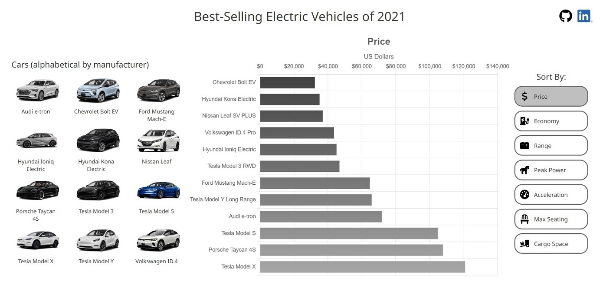
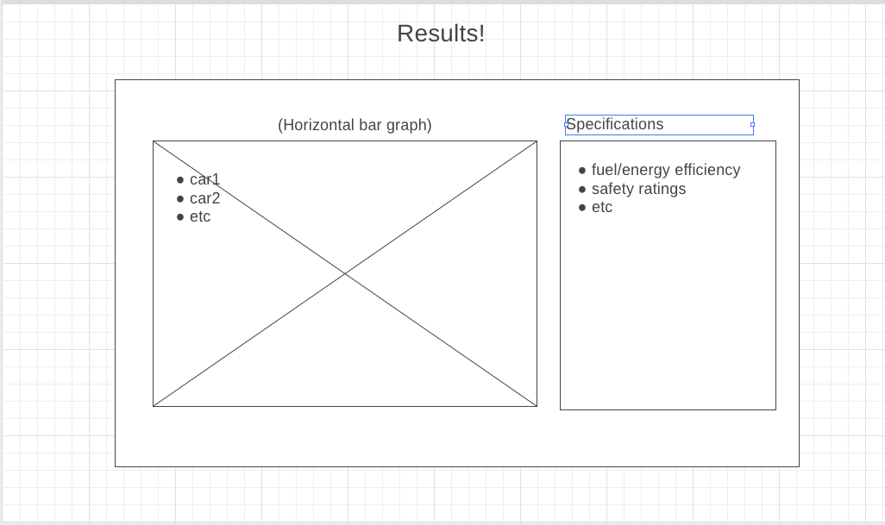

# Best-Selling Electric Vehicles of 2021

Link to the site: https://jason330.github.io/2021-Best-selling-EVs/

## Screenshot:

## Background

At this site, users can get information about and compare through a bar chart the best-selling electric vehicles of 2021 in the United States. Users can choose to sort chart data based on multiple car specification categories such as price, range, and passenger capacity. User selection will update the specification category and sort order of the chart data. 

## Technologies, Libraries, APIs

This project is implemented with the following technologies:

- The Chart.js library to visually display data
- Webpack and Babel to bundle and transpile the source JavaScript code
- npm to manage project dependencies

## Instructions
   - ### Site usage

        1. Simply click on any of the "Sort By:" buttons on the right side of the page to choose which specification category to display in the chart.
        2. Hover over each bar in the chart to get car specific data.

   - ### Setup/installation
        1. Clone the project. Then in your terminal, `cd` into the folder.
        2. Run `node -v` to check your Node.js version. Versions between v12 and v16 should work.
        3. Run `npm install` to install dependencies.
        4. Run `npm start`.
        5. Open **index.html** in your browser.

## Wireframe

- The main panel will display the bar graph.
- The smaller right panel will display specifications, which the user can select to sort the results.

## Implementation Timeline

- Friday:
    - Setup project, including getting webpack up and running.
    - Create HTML skeleton for initial HTTP response
    - Create main panels
    - Test NHTSA API; if not feasible, manually gather data and vehicle images

- Weekend
    - Get car thumbnails to display
    - Implement Results bar graph
        - Create scales for graphs
        - Apply colors/styling to bars

- Monday
    - Get "Specifications" panel to display with custom sort feature

- Tuesday
    - Finish remaining core features
    - Add GitHub link
    - Start styling
        - Fonts
        - Borders
        - Icons

- Wednesday
    - Work on styling
        - Color scheme
        - Animations/transitions
    - If time, improve features
        - Narrow results by cars

- Thursday Morning: Deploy to GitHub pages. If time, rewrite this proposal as a production README.

## Technical Implementation Details

There is an array of objects, with each object containing individual car data.

There are multiple variables to manage chart updates, such as the currently selected category, chart axis units, and chart axis labels.

The bar colors are based on a canvas gradient.

There is an event listener on the specification category list, which updates the selected category and the chart.

## Future Features

1. Allow the user to select specific cars, either to display only the selected cars in the chart, or to highlight the selected bars in the chart.
2. Improve color scheme.
3. Improve layout, possibly by adding car data, such as safety ratings.